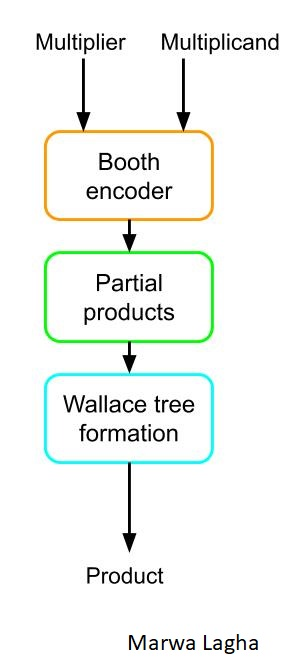
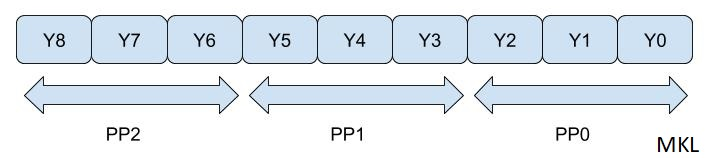
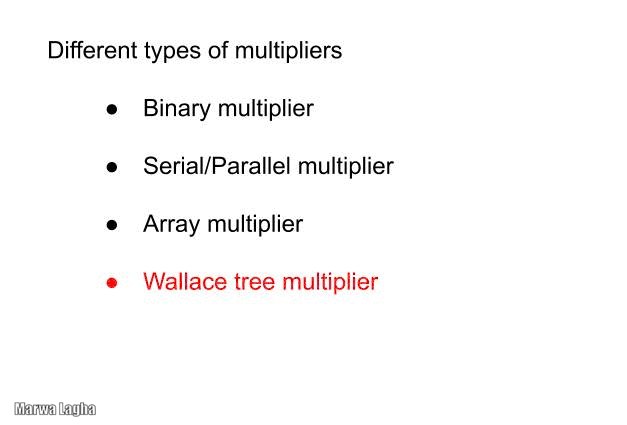
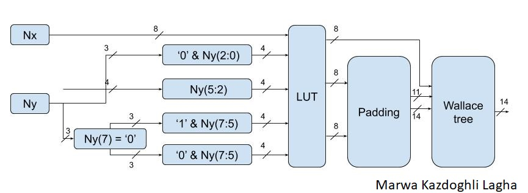
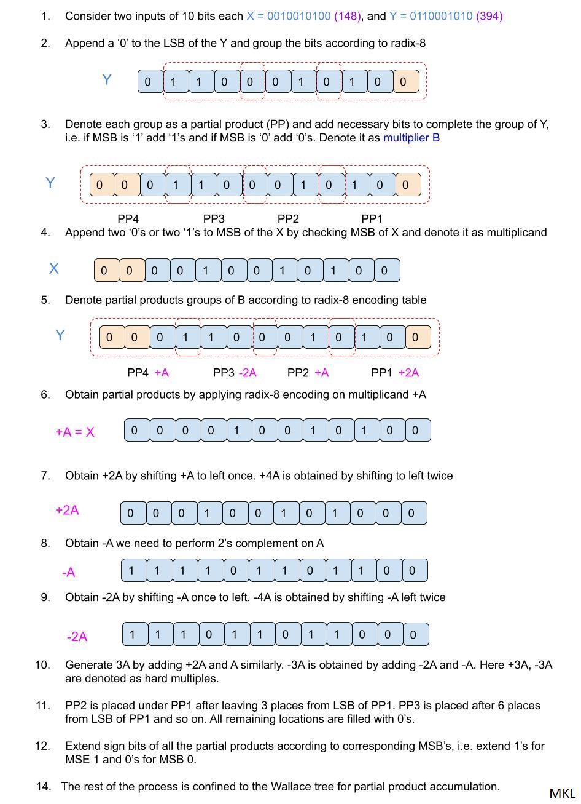
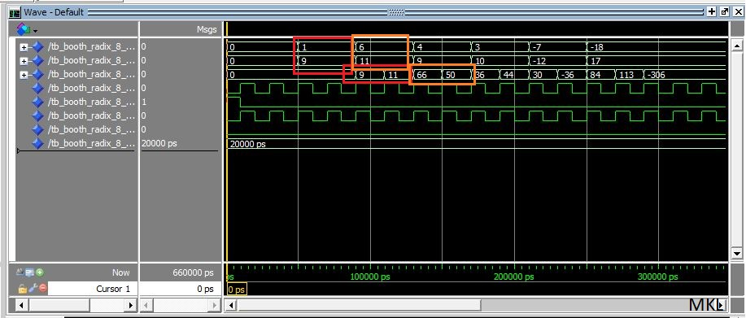
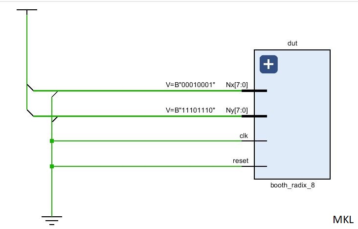
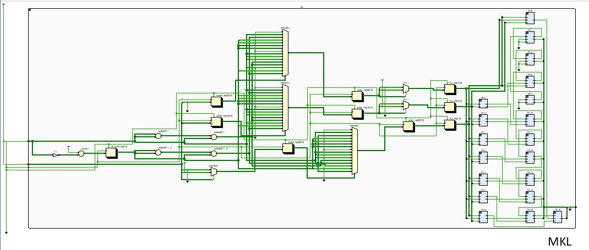

# VHDL implementation of Booth Wallace Algorithm

The multiplication operation is present in many parts of a digital system or digital computer, most notably in signal processing,
graphics and scientific computation. With advances in technology, various techniques have been proposed to design multipliers,
which offer high speed, low power consumption and lesser area. This work is devoted for the design and simulation of Radix-8 Booth Encoder multiplier for signed-unsigned numbers. 

The final project report contains: 
* [Introduction of modified booth algorithm](#introduction-of-modified-booth-algorithm)
* [Project steps](#project-steps)
* [Conclusions](#conclusions)
 
 ## Introduction of modified booth algorithm

Many application systems based on DSP require extremely fast processing of a huge amount of digital data. The multiplier is an essential element of the digital signal
processing such as filtering and convolution. Any multiplier can be divided into three stages: 
1. Partial products generation stage
2. Partial products addition stage
3. Final addition stage. 

The speed of multiplication can be increased by reducing the number of partial products. Many high-performance algorithms and architectures have been
proposed to accelerate multiplication. Various multiplication algorithms such as Booth, Modified Booth, Braun, and Baugh-Wooley have been proposed.

The __modified__ __Booth__ __algorithm__ reduces the number of partial products to be generated and is known as the fastest multiplication algorithm. Also,
__Wallace__ __Tree__ __Carry__ __Save__ __Adder__ structures have been used to sum the partial products in reduced time.

:arrow_forward:  Our goal is to reduce computation time by using __Booth's__ __algorithm__ for multiplication and to reduce chip area by using Carry Save Adders arranged in a __Wallace__ __tree__ structure.

 In this part, we will present the wallace booth multiplier. An illustration of the block diagram of wallace booth multiplier is depicted below.
 

* Booth encoder
Booths algorithm involves encoding of multiplier bits and partial product generation. Different modified booths algorithms have been proposed according to how many number of bits are used to encode multiplier. Modified booth
algorithm reduces the number of partial products. Radix 2, radix 4, radix 8, radix 16, radix 32 are the different modified booth algorithms. NxN bit multiplication involves N partial products but modified Radix <code>2r</code>
produces N/r partial .
In this work, we will propose the radix 8 booth encoder. In radix-8 Booth recoding, we take quartets of bits. The grouping of bits in radix 8 method is shown in the figure below.

 

 Each quartet is codified as a signed digit using Table below. Radix-8 algorithm reduces the number of partial products to n/3, where n is the
number of multiplier bits. Thus it allows a time gain in the partial products summation.

		radix-8 booth recoding

| Multiplier bits   | Recoded operation on |
| Yi+2 Yi+1 Yi Yi-1 | multiplicand, X      |
-----|----|----|--- | ---------------------
| 0  | 0  | 0  | 0  |          0X          |
| 0  | 0  | 0  | 1  |          +X          |
| 0  | 0  | 1  | 0  |          +X          |
| 0  | 0  | 1  | 1  |          +2X         |
| 0  | 1  | 0  | 0  |          +2X         |
| 0  | 1  | 0  | 1  |          +3X         |
| 0  | 1  | 1  | 0  |          +3X         |
| 0  | 1  | 1  | 1  |          +4X         |
| 1  | 0  | 0  | 0  |          -4X         |
| 1  | 0  | 0  | 1  |          -3X         |
| 1  | 0  | 1  | 0  |          -3X         |
| 1  | 0  | 1  | 1  |          -2X         |
| 1  | 1  | 0  | 0  |          -2X         |
| 1  | 1  | 0  | 1  |          -X          |
| 1  | 1  | 1  | 0  |          -X          |
| 1  | 1  | 1  | 1  |          0X          |

Note that the sign extension corrector is designed to enhance the ability of the booth multiplier to multiply not only the unsigned number but also the signed number. 
The working principle of sign extension that converts signed multiplier signed unsigned multiplier as follows.
One bit control signal called signed-unsigned(s_u) bit is used to indicate whether the multiplication operation is signed
number or unsigned number. When sign-unsign s_u=0, it indicates unsigned number multiplication and when s_u=1, it indicates signed number multiplication.

| Sign_unsign | Type of operation       |
------------- | ---------------------
| 0           | Unsigned multiplication |
| 1           | Signed multiplication   |

* Partial products

A product formed by multiplying the multiplicand by one digit of the multiplier when the multiplier has more than one digit. Partial
products are used as intermediate steps in calculating larger products.

Partial product generator is designed to produce the product by multiplying the multiplicand A by 0, 1, -1, 2, -2,-3, 3, -4,4. 
For product generator:
1. Multiply by zero means the multiplicand is multiplied by “0”.
2. Multiply by “1” means the product still remains the same as the multiplicand value. 
3. Multiply by “-1” means that the product is the two’s complement form of the number.
4. Multiply by “-2” is to shift left one bit the two’s complement of the multiplicand value and multiply by “2” means just shift left the multiplicand by one place. 
6. Multiply by “-4” is to shift left two bit the two’s complement of the multiplicand value and multiply by “2” means just shift left the multiplicand by two place. 

Here we have an odd multiple of the multiplicand, 3X, which is not immediately available. To generate it we need to perform this previous add: 2Y+Y=3Y. But we are designing a multiplier for specific
purpose and thereby the multiplicand belongs to a previously known set of numbers which are stored in a memory chip. We have
tried to take advantage of this fact, to ease the bottleneck of the radix-8 architecture, that is, the generation of 3X.

7. To generate 3X with 8-bit words we only have to add 2X+X, that is, to add the number with the same number shifted one position to the left.

* Wallace tree

The Wallace tree method is used in high speed designs in order to produce two rows of partial products that can be added in the last stage. Half adder, full adder, unit adder and
carry save adders are employed in Wallace tree structure to reduce partial products. Wallace tree accelerate the accumulation of the partial products. The speed, area and
power consumption of the multipliers will be in direct proportion to the efficiency of the compressor. The structure is made of carry save adders. The carry save adders reduce the
number of partial products and sum rows.

An illustration of the wallace tree multiplier is presented bellow.

 
 

 ## Project steps
 
The proposed technical levels are:

1. Booth wallace VHDL & testbench implementation
2. Evaluate the behavioral simulation
3. Synthesis of the project

### 1. Booth wallace VHDL & testbench implementation

The block diagram of the implemented booth wallace algorithm is depicted in the figure below. 

 
 
As presented in wallace tree, we form a series of products in between the multiplicand Y and every bit of the multiplier X resulting in partial products.
However, when using the radix-8 recoding, we provide gain in time while summing up the partial products as partial products are reduced to n/3 for n bits 
of multiplier and multiplicand.

An example of radix-8 encoding to obtain partial products is presented below.

  
 
The test-bench is also implemented to evaluate the effectivness of the VHDL code.
Next, we will evaluate the presented VHDL implementation.

### 2. Evaluate the behavioral simulation

We run the behavioral simulation using Modelsim software. The resulted output is depicted in the Figure below.

 

The output from the simulation contains the expectede values of multiplications.

### 3. Synthesis of the project

Figure below shows the RTL view of the Wallace booth algorithm.
 
  

 
## Conclusions

The Radix-8 Booth Encoder circuit generates n/3 the partial products in parallel. By extending sign bit of the operands
and generating an additional partial product the signed of unsigned Radix-8 Booth Encoder multiplier is obtained. 
The wallace tree adder used to speed up the multiplier operation. Since signed and unsigned
multiplication operation is performed by the same multiplier unit the required hardware and the chip area reduces and this in turn
reduces power dissipation and cost of a system.

Thanks for the lecture.
Marwa.

